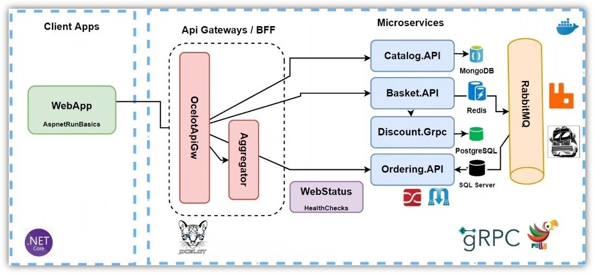

## Overview
This project is a e-commerce microservice demo application covering Clean Architecture, Domain-Driven Design (DDD), Command Query Responsibility Segregation (CQRS), MediatR, and Docker for containerization and deployment.



## How to Run
First of all, clone this repo. Then, make sure Docker is installed on your computer and run the following code in the location where docker-compose.yml file is located.

```sh
docker-compose -f .\docker-compose.yml -f .\docker-compose.override.yml up --build -d
```

### After it has succesfully run
